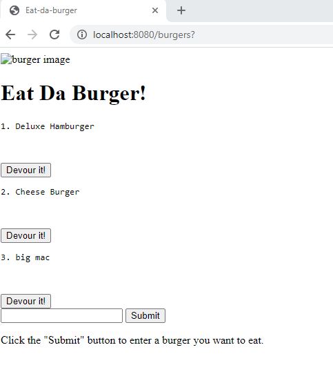
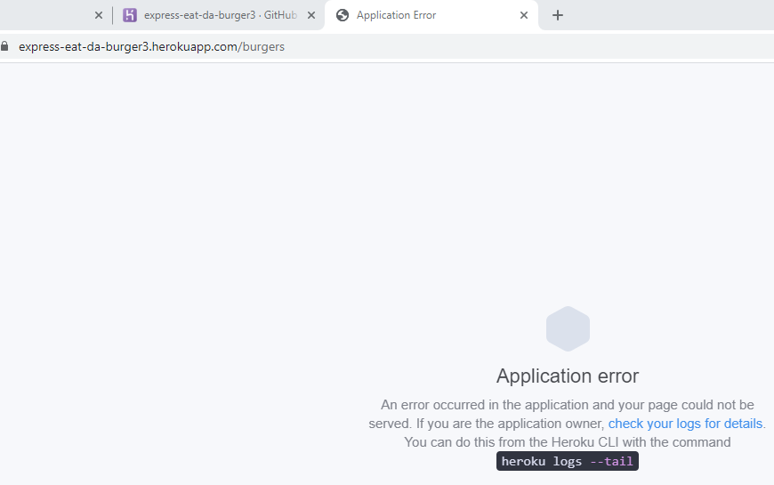

# eat-da-burger

## Project Description
In this assignment, we were tasked with creating a burger logger with MySQL, Node, Express, Handelbars and a homemade ORM following the MVC design patterns.

* Eat-Da-Burger! is a restaurant app that lets users input the names of burgers they'd like to eat.

* Whenever a user submits a burger's name, your app will display the burger on the left side of the page -- waiting to be devoured.

* Each burger in the waiting area also has a Devour it! button. When the user clicks it, the burger will move to the right side of the page.

* Your app will store every burger in a database, whether devoured or not.

## Experience
I was able to utilize the CatsApp to assist with the coding so that was helpful. Although the going back and forth between files lead to a lot of mix-ups with the code.

## Issues
1. Currently my app is not deploying appropriately as viewed by my screen shot of the app. I am able to add burgers but not able to devour it. I hope to continue working to fix this issue.

2. I had trouble with loading to Heroku as indicated and hope to continue to work on this also.

